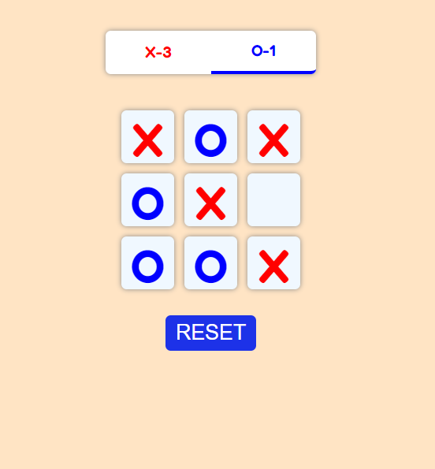

# Tic Tac Toe Game in React 

Welcome to the Tic Tac Toe game in React! This simple project is designed for beginners who want to learn the basics of building a web application using React. 



## Table of Contents

- [Prerequisites](#prerequisites)
- [Getting Started](#getting-started)
- [Project Structure](#project-structure)
- [Game Logic](#game-logic)
- [Components](#components)
- [Running the Application](#running-the-application)
- [Additional Features](#additional-features)

## Prerequisites

Before you begin, make sure you have the following software installed on your system:

- Node.js: You can download it [here](https://nodejs.org/).

## Getting Started

1. **Create a React App**: You can create a new React app using [Create React App](https://reactjs.org/docs/create-a-new-react-app.html#create-react-app).

   ```bash
   npx create-react-app tic-tac-toe
   ```

2. **Navigate to Your Project Folder**:

   ```bash
   cd tic-tac-toe
   ```

3. **Delete the Default Files**:

   You can delete the default files created by Create React App (e.g., `src/App.js`, `src/App.css`) and replace them with the files provided in this project.

4. **Install Dependencies**:

   Install any required dependencies for this project, such as React and ReactDOM.

   ```bash
   npm install react react-dom
   ```

5. **Copy the Project Files**:

   Copy the project files provided in this repository into your project folder.


## Game Logic

The game logic is relatively simple:

- Players take turns marking a square on the 3x3 grid with their symbol (X or O).
- The game checks for a winner after each move.
- The game declares a winner if one player has three of their symbols in a row, column, or diagonal.
- If all squares are filled and there's no winner, the game ends in a draw.

## Components

The main components of the Tic Tac Toe game are as follows:

- **`App`**: The root component that manages the game state.
- **`Board`**: Represents the game board, which contains nine squares.
- **`Box`**: Represents a single square on the board.

You can explore these components to understand how they work together to create the game.

## Running the Application

To run the application, use the following command in your project directory:

```bash
npm start
```

This will start the development server, and you can access the game in your web browser at `http://localhost:3000`.


